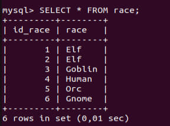

# Task 2 Database Administration

## Part 1

### 1.1 Install MySQL server on VM
I used command `sudo apt install mysql-server` to install MySQL Server
after that i used `sudo mysql_secure_installation` to setup basic security parameters, such as root user password

### 1.2 Create database on server via console
`create database `

```
Create table characters (
id_charact int PRIMARY KEY
id_prof int(10) NOT NULL,
id_race int(10) NOT NULL,
name varchar (20) NOT NULL,
FOREIGN KEY (id_race) REFERENCES race (id_race),
FOREIGN KEY (id_prof) REFRENCES professions (id_prof)
);

Create table race (
id_race int(10) PRIMARY KEY,
race varchar(50) NOT NULL
);
Create table professions (
id_prof int(10) PRIMARY KEY,
profession varchar (100) NOT NULL,
weapon varchar(100) NOT NULL,
);
```


### 1.3 Fill tables





### 1.4 Construct and execute SELECT operator with WHERE, GROUP BY and ORDER BY

```
SELECT COUNT(id_prof), race, name FROM characters WHERE id_prof =2 
GROUP BY name, race ORDER BY race

```


### 1.5 Execute other different SQL queries (DDL, DML, DCL)

Data definition language (DDL) is a group of data definition operations. In other words, with the help of an action included in this group, we determine the presence of a database and work with objects, i.e. create, modify and delete them.
This group includes possible operators:
*CREATE - used to create database objects.
*ALTER - used to change database objects.
*DROP - used to remove database objects.

Data Manipulation Language (DML) is a group of operators for data manipulation. With the help of these operators, we can add, modify, delete and unload data from the database, i.e. manipulate them.
This group includes the most common SQL statements:
*SELECT - fetches data.
*INSERT - adds new data.
*UPDATE - changes existing data.
*DELETE - deletes data.

Data Control Language (DCL) - a group of operators for defining data access. In other words, these are operators for managing permissions, with the help of them we can allow or prohibit the performance of certain operations on database objects.

This includes:
*GRANT - grants a user or group permissions to perform certain operations on an object;
*REVOKE - revokes issued permissions;
*DENY - sets the prohibition, which has priority over the permission.


### 1.6 Create users with different privileges and verify their grants


### 1.7 Make a selection from the main table DB MySQL


## Part 2

### 2.1 Make backup of my database
The mysqldump client utility performs logical backups, producing a set of SQL statements that can be executed to reproduce the original database object definitions and table data. Usually backup files have the extension sql.


### 2.2 Delete the table and/or part of the data in the table. 


### 2.3 Restore database.


### 2.4 Transfer local database to RDS AWS, connect to DB instance, execute SELECT operator and create dump of database


## Part 3

### 3.1 Install MongoDB 
Installed mongo db on windows


### 3.2 Create collection in the database test


### 3.3 Create and complete some documents


