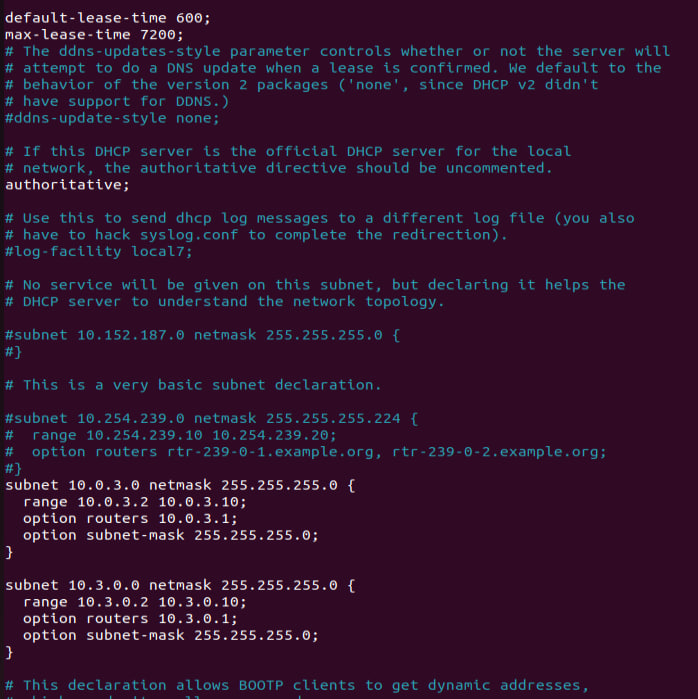

# Task 3 Linux Networking

## 1. Configured interfaces on Server_1 as static

First, in the settings of the virtual machine, I set "Network bridge" on the first interface, and "Internal network" on the other two.

After that, using the command `sudo nano /etc/netplan/01-network-manager-all.yaml`,
went into the settings of the netplan utility, which is used to configure the network, then I set up a static address for the interface that had internet access, 
and two others for the task.

Then applied the new settings using the commands `sudo netplan apply`, and restart the network manager. `systemctl restart network-manager`. 

## 2. Configuring the DHCP server that will configure the addresses of int1 Client_1 and Client_2

Install DHCP server on Serve_1 using the command `sudo apt install isc-dhcp-server`.
The main configuration file of ISC DHCP server is `/etc/dhcp/dhcpd.conf`.

It’s always a good idea to backup original configuration files. In case if something goes wrong, the original configuration can easily be restored. 

`sudo mv /etc/dhcp/dhcpd.conf{,.backup}` `#Expands to sudo mv /etc/dhcp/dhcpd.conf /etc/dhcp/dhcpd.conf.backup`

After changing the settings, I restart the DHCP server with the command, `sudo systemctl restart isc-dhcp-server.service`

## 3. Setting up communication and checking access to the Internet through Server_1

In order for packets in the Server_1 local network to be freely transmitted between each other and to the Internet,
we need to configure FORWARD in the iptables utility. 
For example: using the commands `iptables -A FORWARD -s 10.0.3.0/24 -j ACCEPT`, `iptables -A FORWARD -s 10.0.3.0/24 -j ACCEPT`, 
we allow packet routing over LAN 10.0.3.0/24. And in the same way we configure FORWARD for the 10.3.0.0/24 network.
Also, to make our Server_1 a router, we include ip_forward. Using the command `sysctl -w net.ipv4.ip_forward=1`, 
but after a reboot OS, this command will not work, so we need to go and make a change to the config file, which is located `/etc/sysctl.conf`.

For the changes in the sysctl.conf file to take effect, run the command: `sysctl -p /etc/sysctl.conf`
Allowing forwarded packets to be received through a firewall-protected internal interface allows hosts on the local network to communicate with each other,
while still not being able to access external hosts on the Internet. 
In order for LAN hosts with private IP addresses to communicate with external networks, IP spoofing must be configured on the firewall,
which will mask the LAN hosts under the IP address of the firewall's external interface(in this case, enps0s3).
For example: using the commands `sudo iptables -t nat -A POSTROUTING -o enps0s3 -d 10.0.3.0/24 -j MASQUERADE`.
And in the same way we configure for the 10.3.0.0/24 network.

This rule uses the NAT packet mapping table (-t nat) and selects the built-in POSTROUTING chain for NAT (-A POSTROUTING) on the firewall's external network interface. The POSTROUTING chain allows you to modify the packets that exit the external firewall device. The -j MASQUERADE assignment is specified to mask the host's private IP address behind the firewall/gateway's external IP address.

## 4. Raising additional addresses on the lo interface on client_1 and configuring traffic

The loopback interface is configured in a special file `ifcfg-lo`, which is located: `cd /etc/sysconfig/network-scripts/`

After changing the settings, I restart the network, using the command `sudo systemctl restart network`.
Next, I configure ip route so that packets from 172.17.13.1 via the interface that is connected to the local network with Server_1.
`sudo ip route add 172.17.13.1 via 10.0.3.2` 

and the same for the second loopback interface.
`sudo ip route add 172.17.23.1 via 172.16.3.2` 

## 5. Calculating the overall subnet mask and setting it

## 6. Installed and configured SSH server

## 7. Configuration on Server_1 firewall

To configure the firewall, we will use the iptables utility, to configure the firewall so that client2 cannot connect to client1 via ssh, 
use the commands `sudo iptables -A INPUT -p tcp -s 10.3.0.5 --dport ssh -j DROP`, 
and in order for the ping that goes with icmp packets not to go to 172.17.23.1, 
use `sudo iptables -A FORWARD -p tcp -s 172.17.23.1 --dport icmp -j DROP`.
To check if the firewall settings are set correctly, use the command `sudo iptables -L -v`.

