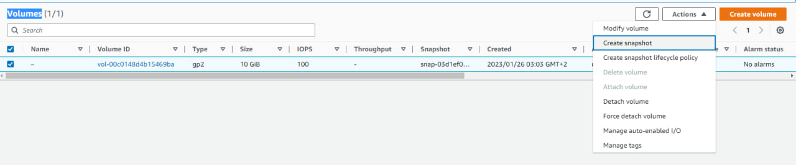
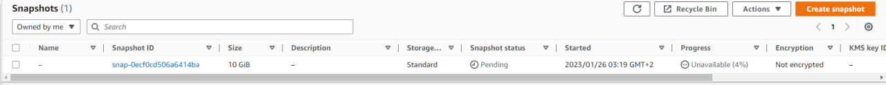

# Task 4 Work at AWS

## 1. Elevate a VM in EC2 AWS

In the AWS main menu, select "Service">"Compute">"EC2" at the top left, then click "Launch instances", and fill in the fields such as: Name, select OS, create a key pair, and select the type of instance.

## 2. Create shapshot of instance

In the menu on the left, go to the section "Elastic Block Store"(I will continue to call abbreviated EBS) in the subsection "Volumes", and click "Create snapshot", and thus create a backup copy of our instance.

## 3. Create an additional disk and attaching it to the VM.

Create a new empty volume by clicking the "Create volume" button at the top right.

Log in using ssh key pair, we check if a new disk has appeared using the command `lsblk`.

The disk is present but not connected to the instance, we can't write anything to it yet. First you need to make it available for use,
for this you first need to check if the file system is installed on the new volume.
This is done with `file -s`, if the output just shows "data", then there is no file system.

To mount a filesystem, use the `mkfs -t` command followed by the name of the filesystem we want to mount and on which volume.
To mount a volume, you need to create a directory at the root, and mount the new volume to it.

## 4. Create a new instance, and attach disk_D to the new instance.

It is very important when creating and moving a volume that both VMs are in the same "Availability Zone".

## 5. Create a domain and domain name for your own website

Create an account on nic.ua, and go to your personal account.

Click on the "Domains" > "register a domain". And come up with a domain name.

Check if such a domain is already registered.

Choose free

After that, go to your personal account in "Name Servers", and select the newly created domain, and go to its settings.

Now in AWS, in the "Services" section, go to the "Networking & Content Delivery" subsection, and select "Route 53".

After that, go to the "Hosted Zones" section and create a new host zone, enter the data from this zone in "DNS", in nic.ua

## 6. Launch and configure a WordPress instancewith Amazon Lightsail

After installation, click either on the three dots and "connect", or on the CLI icon.

## 7. Work with S3 through a browser, and AWS CLI

Enter "IAM" in the search for AWS services, and in the menu that opens, click create a new user, and give him Administrator rights.

After that, download the file with access settings to your computer. Open "cmd" and type "aws configure"

We can now upload files to the previously created bucket using the CLI.

## 8. Deploy Docker Containers on Amazon Elastic Container Service (Amazon ECS)

First, let's go to the EC2 instance, and install the docker there.

I create a repository in ECR (Elastic Container Registry), and according to the instructions from AWS ECR, push application

After pushing the application, go to AWS Elastic Container Service (ECS), in the "Clusters" subsection, and create a cluster.

Then after creating the cluster, go to "Task definition"

After creating the containers in "Task definition" go back to "Clusters" and select "Run task".

## 9. Run a Serverless "Hello, World!" with AWS Lambda

## 10. creating a CV with S3

